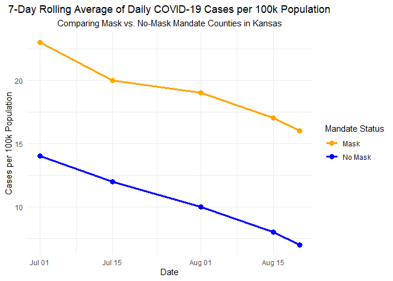
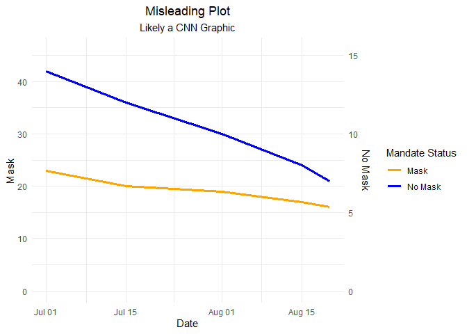

Lab 07 - Conveying the right message through visualisation
================
Jamieson Nathan
04/09/2025

### Load packages and data

``` r
library(tidyverse) 
```

### Exercise 1

``` r
covid_data <- tribble(
  ~date,       ~cases_per_100k, ~mask_mandate,
  "2020-07-01", 23,             "Mask",
  "2020-07-01", 14,             "No Mask",
  "2020-07-15", 20,             "Mask",
  "2020-07-15", 12,             "No Mask",
  "2020-08-01", 19,             "Mask",
  "2020-08-01", 10,             "No Mask",
  "2020-08-15", 17,             "Mask",
  "2020-08-15", 8,              "No Mask",
  "2020-08-20", 16,             "Mask",
  "2020-08-20", 7,              "No Mask"
)

print(covid_data)
```

    ## # A tibble: 10 × 3
    ##    date       cases_per_100k mask_mandate
    ##    <chr>               <dbl> <chr>       
    ##  1 2020-07-01             23 Mask        
    ##  2 2020-07-01             14 No Mask     
    ##  3 2020-07-15             20 Mask        
    ##  4 2020-07-15             12 No Mask     
    ##  5 2020-08-01             19 Mask        
    ##  6 2020-08-01             10 No Mask     
    ##  7 2020-08-15             17 Mask        
    ##  8 2020-08-15              8 No Mask     
    ##  9 2020-08-20             16 Mask        
    ## 10 2020-08-20              7 No Mask

### Exercise 2

``` r
library(ggplot2)
library(tibble)

covid_data$date <- as.Date(covid_data$date, "%Y-%m-%d")

ggplot(data = covid_data, aes(x = date, y = cases_per_100k, color = mask_mandate, group = mask_mandate)) +
  geom_line(size = 1.2) +
  geom_point(size = 3) +
  scale_color_manual(values = c("Mask" = "orange", "No Mask" = "blue")) +
  labs(title = "7-Day Rolling Average of Daily COVID-19 Cases per 100k Population",
       subtitle = "Comparing Mask vs. No-Mask Mandate Counties in Kansas",
       x = "Date",
       y = "Cases per 100k Population",
       color = "Mandate Status") +
  theme_minimal() +
  theme(plot.title = element_text(hjust = 0.5), 
        plot.subtitle = element_text(hjust = 0.5))
```

    ## Warning: Using `size` aesthetic for lines was deprecated in ggplot2 3.4.0.
    ## ℹ Please use `linewidth` instead.
    ## This warning is displayed once every 8 hours.
    ## Call `lifecycle::last_lifecycle_warnings()` to see where this warning was
    ## generated.

<!-- -->

Based on this visual, which ahs approximately the same shape of data, it
is clear that the no mask counties have has lower rates of COVID-19
cases.

The discrepency in visuals show how rife misinformaion and politicizing
data was during this period! Although we have not tested whether the
difference is significant, this shows at a face-value that no mask
counties had lower rates. I could see this being explained in a few
ways: 1) no mask counties had another variable that made them less
suceptible (lower population density, more rural, etc.), 2) masks
somehow increase rates of COVID (less likely, if anything I would think
rates would be comparable), or 3) Rates of testings were higher in
mask-mandate counties.

``` r
ggplot() +
  geom_line(
    data = subset(covid_data, mask_mandate == "Mask"),
    aes(x = date, y = cases_per_100k, color = "Mask"),
    size = 1.2
  ) +
  geom_line(
    data = subset(covid_data, mask_mandate == "No Mask"),
    aes(x = date, y = cases_per_100k * 3, color = "No Mask"),
    size = 1.2
  ) +
  scale_color_manual(
    name = "Mandate Status",
    values = c("Mask" = "orange", "No Mask" = "blue")
  ) +
  scale_y_continuous(
    name = "Mask",
    limits = c(0, max(covid_data$cases_per_100k) * 2),
    sec.axis = sec_axis(~ . / 3, name = "No Mask")
  ) +
  labs(
    title = "Misleading Plot",
    subtitle = "Likely a CNN Graphic",
    x = "Date"
  ) +
  theme_minimal() +
  theme(
    plot.title = element_text(hjust = 0.5),
    plot.subtitle = element_text(hjust = 0.5)
  )
```

<!-- -->

The key difference between these two is the differing Y-Axes, such that
at face-value the no-mask line appears to be higher, even though they
are not corresponding to the same scale.

This new visual conveys an even more dramatic difference in lines, and
to the untrained eye it appears as it ‘should’, with the no mask
counties having higher rates.
